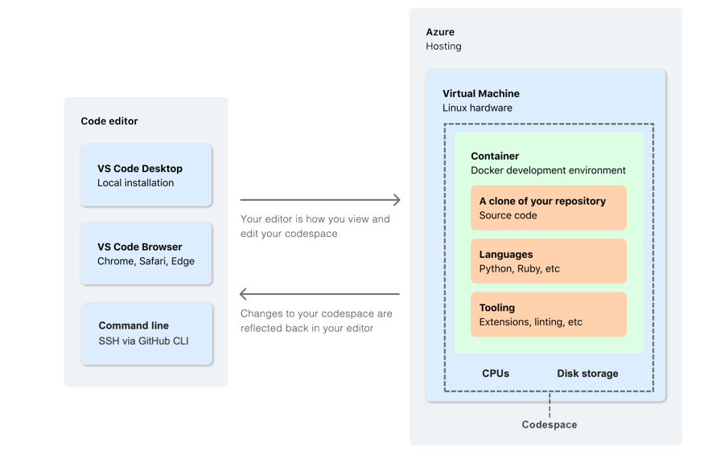

# Unit 1: Introduction to GitHub

## Learning Objectives
After completing this unit, you will be able to:
- Explain what GitHub is and its role in modern software development
- Navigate the GitHub platform and use its core features
- Understand how GitHub Codespaces enables faster development
- Create and manage repositories, branches, and pull requests

---

## 1. Overview of GitHub Platform
[](https://www.youtube.com/watch?v=NUELGzIHT-I)
<p align="center">
  <em>▶ Click to play video</em>
</p>

Before we explore the GitHub platform in detail, it's important to understand what it's built on: **Git**.

**Git** is a **distributed version control system** that lets developers track changes, collaborate on code, and manage revisions over time. **GitHub** builds on top of Git by adding collaboration tools, automation features, and a user-friendly web interface. 

### What is GitHub?
GitHub is a cloud-based platform for version control and collaboration. It uses Git, a distributed version control system, to track changes in source code during software development.


<br>

**Key Benefits:**
- 🔄 **Version Control**: Track every change to your code
- 🤝 **Collaboration**: Work with teams worldwide
- 📦 **Project Management**: Issues, projects, and discussions
- 🔒 **Security**: Advanced security features and vulnerability scanning
- 🚀 **CI/CD**: GitHub Actions for automation

### How GitHub Works

```
┌─────────────────┐
│  Remote Repo    │  (GitHub.com)
│   (Origin)      │
└────────┬────────┘
         │
    push │ pull
         │
┌────────┴────────┐
│  Local Repo     │  (Your Computer)
│  + Working Dir  │
└─────────────────┘
```

---

## 2. Core Features of GitHub

### Repositories
A repository (repo) is a container for your project that tracks all changes.

**Key Repository Features:**
- **Branches**: Separate lines of development
- **Commits**: Snapshots of your changes
- **Pull Requests**: Propose and review changes
- **Issues**: Track bugs and feature requests
- **Wiki**: Documentation for your project

### GitHub Flow
```
main branch
    │
    ├─── feature-branch (create)
    │         │
    │         ├─── commit 1
    │         ├─── commit 2
    │         └─── Pull Request → Review → Merge
    │
    └─── Updated main branch
```

**Steps to create GitHub repository:**  [Link](https://learn.microsoft.com/en-gb/training/modules/introduction-to-github/2-what-is-github?wt.mc_id=studentamb_202028)

### Issues and Project Management
- **Issues**: Track tasks, bugs, and feature requests

- **Labels**: Categorize and filter issues

- **Milestones**: Group issues into releases

- **Projects**: Kanban-style project boards


### Collaboration Features
- **Pull Requests**: Code review workflow

- **Code Review**: Inline comments and suggestions

- **Discussions**: Community conversations

- **Notifications**: Stay updated on activity

#### Explore further: 
1) [GitHub collabration tool](https://learn.microsoft.com/en-gb/training/modules/introduction-to-github/4-collaborative-platform?wt.mc_id=studentamb_202028)
2) [GitHub platform management](https://learn.microsoft.com/en-gb/training/modules/introduction-to-github/5-platform-management?wt.mc_id=studentamb_202028)
---

## 3. GitHub Codespaces: Faster, Frictionless Development

### What is GitHub Codespaces?
GitHub Codespaces is a cloud-based development environment that runs directly in your browser or VS Code.

**Benefits:**
- ⚡ **Instant Setup**: Pre-configured development environments
- 🌐 **Accessible Anywhere**: Code from any device
- 🔧 **Consistent Environment**: Same setup for all team members
- 💪 **Powerful Compute**: Use cloud resources for heavy tasks

### How Codespaces Works


### Key Features
- **Pre-built environments**: Start coding immediately
- **Extensions**: Pre-installed VS Code extensions
- **Secrets**: Securely stored credentials
- **Port forwarding**: Test web apps easily

### How to Access


**Note: All personal GitHub accounts have a monthly quota of free use of GitHub Codespaces**
> The free plan offers 120 hours of usage for 1 core or 60 hours for 2 cores, plus 15 GB of storage per month.

---
## Hands-On Exercises

### Exercise 1: Create Your First Repository
1. Go to [github.com](https://github.com) and sign in
2. Click the **+** icon → **New repository**
3. Name it `hello-world`
4. Add a description: "My first GitHub repository"
5. Check "Add a README file"
6. Click **Create repository**

### Exercise 2: Make Your First Commit
1. In your `hello-world` repository, click on `README.md`
2. Click the pencil icon (Edit)
3. Add the following content:
   ```markdown
   # Hello World
   
   This is my first GitHub repository!
   
   ## About Me
   I'm learning GitHub and AI-powered development.
   ```
4. Scroll down, add commit message: "Update README with introduction"
5. Click **Commit changes**

### Exercise 3: Create a Branch and Pull Request
1. In your repository, click the branch dropdown (shows "main")
2. Type `feature/add-bio` and press Enter to create
3. Edit `README.md` on this branch
4. Add your bio under "About Me"
5. Commit the changes
6. Click **Pull requests** → **New pull request**
7. Review changes and click **Create pull request**
8. Add a description and click **Create pull request**
9. Review and click **Merge pull request**

### Exercise 4: Launch GitHub Codespaces
1. Go to your repository
2. Click the **Code** button (green)
3. Select **Codespaces** tab
4. Click **Create codespace on main**
5. Wait for the environment to load
6. Explore the VS Code interface in your browser

---

## Code Examples

### Example 1: Basic Git Commands

**Local Repository Setup:**
```bash
# Clone a repository
git clone https://github.com/username/repo-name.git

# Navigate to repository
cd repo-name

# Check status
git status

# Create a new branch
git checkout -b feature/new-feature

# Stage changes
git add .

# Commit changes
git commit -m "Add new feature"

# Push to GitHub
git push origin feature/new-feature

```
> *Checkout [GitHub Cheetsheet](https://education.github.com/git-cheat-sheet-education.pdf) and learn more about Git commands.*

---
## Real-World Scenario

### Scenario: Team Collaboration on a Web Project

**Context**: You're joining a team building a web application.

**Workflow:**
1. **Clone the repository** to get the code
2. **Create a feature branch** for your task
3. **Use Codespaces** for consistent environment
4. **Make changes** and commit regularly
5. **Open a Pull Request** for code review
6. **Address feedback** and update your PR
7. **Merge** after approval

**Benefits:**
- ✅ No local setup required (Codespaces)
- ✅ Code review ensures quality
- ✅ Branch protection prevents breaking changes
- ✅ Team visibility through Issues and PRs
---


## Lab: Get Started with GitHub

Click here to access [Interactive Lab : Introduction to GitHub](https://github.com/skills/introduction-to-github)

### Lab Objective
Create a complete project repository with proper structure and documentation.

---
## Additional Resources

### Documentation
- [GitHub Docs: Getting Started](https://docs.github.com/en/get-started)
- [GitHub Codespaces Documentation](https://docs.github.com/en/codespaces)

### Interactive Tutorials
- [GitHub Skills: First Day on GitHub](https://github.com/skills/introduction-to-github)
- [Microsoft Learn: Introduction to GitHub](https://learn.microsoft.com/en-us/training/modules/introduction-to-github/)

### Video Resources
- [GitHub YouTube Channel](https://www.youtube.com/github)
- [Git and GitHub for Beginners](https://www.youtube.com/watch?v=RGOj5yH7evk)

---

## Summary

In this unit, you learned:
- ✅ What GitHub is and its core features
- ✅ How to create repositories and manage code
- ✅ The GitHub workflow with branches and pull requests
- ✅ How GitHub Codespaces enables cloud-based development
- ✅ Hands-on experience with GitHub's essential features

**Next:** [Unit 2 - Introduction to GitHub Copilot](./unit2-intro-copilot.md)
